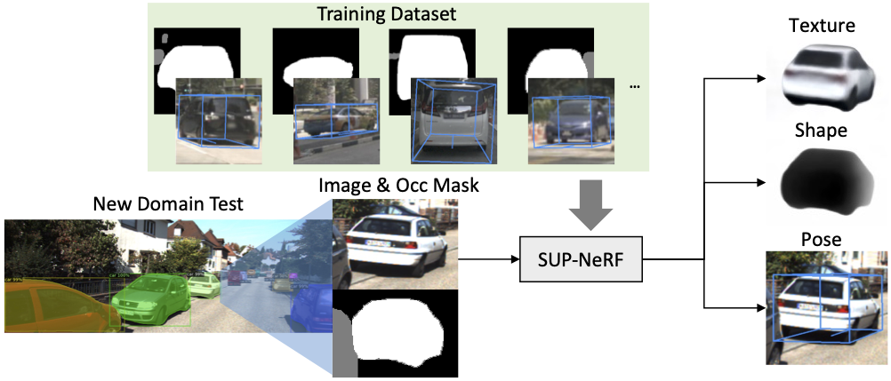

<div align="center">

# [SUP-NeRF: A Streamlined Unification of Pose Estimation and NeRF for Monocular 3D Object Reconstruction](https://arxiv.org/abs/2403.15705)

### [Project Page](https://yuliangguo.github.io/supnerf/) | [Paper](https://arxiv.org/abs/2403.15705) | [Talk](https://www.youtube.com/watch?v=30sS-7OxD9s)

Yuliang Guo, Abhinav Kumar, Cheng Zhao, Ruoyu Wang, Xinyu Huang, Liu Ren\
Bosch Research North America, Bosch Center for AI

in [ECCV 2024](https://eccv.ecva.net/)

<p align="center">
      
</p>


</div>

> Monocular 3D reconstruction for categorical objects heavily relies on accurately perceiving each object's pose. While gradient-based optimization in a NeRF framework updates the initial pose, this paper highlights that scale-depth ambiguity in monocular object reconstruction causes failures when the initial pose deviates moderately from the true pose. Consequently, existing methods often depend on a third-party 3D object to provide an initial object pose, leading to increased complexity and generalization issues. To address these challenges, we present SUP-NeRF, a streamlined Unification of object Pose estimation and NeRF-based object reconstruction. SUP-NeRF decouples the object's dimension estimation and pose refinement to resolve the scale-depth ambiguity, and introduces a camera-invariant projected-box representation that generalizes cross different domains. While using a dedicated pose estimator that smoothly integrates into an object-centric NeRF, SUP-NeRF is free from external 3D detectors. SUP-NeRF achieves state-of-the-art results in both reconstruction and pose estimation tasks on the nuScenes dataset. Furthermore, SUP-NeRF exhibits exceptional cross-dataset generalization on the KITTI and Waymo datasets, surpassing prior methods with up to 50% reduction in rotation and translation error.

<p align="center">
        
</p>

## Citation

If you find our work useful in your research, please consider starring the repo and citing:

```Bibtex
@inproceedings{guo2024supnerf,
   title={{SUP-NeRF: A Streamlined Unification of Pose Estimation and NeRF for Monocular 3D Object Reconstruction}},
   author={Yuliang Guo, Abhinav Kumar, Cheng Zhao, Ruoyu Wang, Xinyu Huang, Liu Ren},
   booktitle={ECCV},
   year={2024}
}
```

## Catalog

- [x] Official pytorch implementation of [SUP-NeRF, ECCV 2024 (Ours)](https://yuliangguo.github.io/supnerf/)
- [x] Unofficial pytorch implementation of [AutoRF, CVPR 2022](https://sirwyver.github.io/AutoRF/)
- [x] Training pipeline for SUP-NeRF and AutoRF on [nuScenes](https://www.nuscenes.org/nuscenes) dataset
- [x] Testing and evaluation pipeline for SUP-NeRF and AutoRF on nuScenes, [KITTI](https://www.cvlibs.net/datasets/kitti/) and [Waymo](https://waymo.com/open/download/) datasets
- [x] Data preparation and curation scripts
- [TODO] Testing and evaluation pipeline for [BootInv, CVPR 2023](https://github.com/google-research/nerf-from-image) on nuScenes, KITTI and Waymo datasets


## Installation

```
conda create -y -n sup-nerf python=3.8
conda activate sup-nerf

conda install pytorch==1.12.1 torchvision==0.13.1 torchaudio==0.12.1 cudatoolkit=11.3 -c pytorch

pip install -r requirements.txt
```

## Data Preparation

<a href="https://huggingface.co/datasets/yuliangguo/SUP-NeRF-ECCV2024">
  
</a>

### nuScenes

We use nuScenes dataset in both training and testing Pipelines. You can save the download NuScenes dataset to you data directory and soft link the related directories to the project `data/NuScenes` directory. The required data structure is as follows:

```bash
SUPNERF
├── data
│      ├── NuScenes
│      │     ├── samples
│      │     ├── maps
│      │     ├── v1.0-mini   
│      │     ├── v1.0-trainval
│      │     ├── pred_instance   
│      │     └── pred_det3d
│      │ ...        
│ ...
```

`samples`, `maps`, `v1.0-mini`, `v1.0-trainval` are directly downloaded from the [nuScenes](https://www.nuscenes.org/nuscenes) dataset.


`pred_instance` includes the required instance masks prepared via a customized script in our folk of [mask-rcnn detectron2](https://github.com/yuliangguo/detectron2/tree/main/demo). Our prepared directory can be directly downloaded from [[dropbox]](https://www.dropbox.com/scl/fi/7yc4855o2lhlk42o52mib/pred_instance.zip?rlkey=ai4h3fe2ni56m6h3dxtweazs8&st=1wte714h&dl=0) [[hugging face]](https://huggingface.co/datasets/yuliangguo/SUP-NeRF-ECCV2024/tree/main/NuScenes/).


`pred_det3d` includes 3D object detection results via a customized script in our folk of [FCOS3D](https://github.com/yuliangguo/mmdetection3d/tree/master/demo). It is only required by previous method AutoRF. If you only consider trying our method, you may not need it. Our prepared directory can be directly downloaded from [[dropbox]](https://www.dropbox.com/scl/fi/i0ov47j8qifebfpmhgxu2/pred_det3d.zip?rlkey=j5pyzyfcgkt1ij4ge69n0pcwm&st=hgzf2vy0&dl=0) [[hugging face]](https://huggingface.co/datasets/yuliangguo/SUP-NeRF-ECCV2024/tree/main/NuScenes/).

It is worth noting that our method follows a object-centric setup, where only a subset of annotated objects are curated for experiments. Please follow our paper for the data curation details. The curated subsets and splits are recorded in those `.json` files in `data/NuScenes`. If you would like to modify the curation, check `src/data_nuscenes.py` to re-run the preprocess step.

### KITTI

We use KITTI dataset in cross-domain generalization test. While all the training are done on nuScenes dataset, KITTI dataset is only used for testing. We following [DEVIANT](https://github.com/abhi1kumar/DEVIANT/blob/main/data/data_setup_README.md) to setup the basic KITTI directry. And we prepare additional directories for our experiments. The required data structure is as follows:

```bash
SUPNERF
├── data
│      ├── KITTI
│      │      ├── ImageSets
│      │      ├── kitti_split1
│      │      └── training
│      │           ├── calib
│      │           ├── image_2
│      │           ├── label_2
│      │           ├── velodyne
│      │           ├── pred_instance
│      │           └── pred
│      │  ...
│ ...
```
Because only the training split of KITTI dataset includes ground-truth object annotations, we conduct cross-domain evaluation on the training split of KITTI dataset.

`calib`, `image_2`, `label_2`, `velodyne` are directly downloaded from the KITTI [website](https://www.cvlibs.net/datasets/kitti/eval_object.php?obj_benchmark=3d). 

Similar to nuScenes, `pred_instance` includes the required instance masks prepared via a customized script in our folk of [mask-rcnn detectron2](https://github.com/yuliangguo/detectron2/tree/main/demo). Our prepared directory can be directly downloaded from [[dropbox]](https://www.dropbox.com/scl/fi/xjcci6wqk26mu9yfogkgc/pred_instance.zip?rlkey=v2mkpv3lwgs02m1c2rmr8y04y&st=c4posdod&dl=0) [[hugging face]](https://huggingface.co/datasets/yuliangguo/SUP-NeRF-ECCV2024/tree/main/KITTI/training/).

Similar to nuScenes, `pred` includes 3D object detection results via a customized script in our folk of [FCOS3D](https://github.com/yuliangguo/mmdetection3d/tree/master/demo). It is only required by previous method AutoRF. Our prepared directory can be directly downloaded from [[dropbox]](https://www.dropbox.com/scl/fi/ueh81g70yjr170xh251au/pred.zip?rlkey=soswt95qt5e5l04fwk6wspta2&st=7o9uoww3&dl=0) [[hugging face]](https://huggingface.co/datasets/yuliangguo/SUP-NeRF-ECCV2024/tree/main/KITTI/training/).

The object-center curated subsets and splits for our experiments are recorded in those `.json` files in `data/KITTI`. If you would like to modify the curation, check `src/data_kitti.py` to re-run the preprocess step.

### Waymo (Front View)

We use Waymo dataset valication split for cross-domain generalization test. While all the training are done on nuScenes dataset, KITTI dataset is only used for testing. We following [DEVIANT](https://github.com/abhi1kumar/DEVIANT/blob/main/data/data_setup_README.md) to prepare waymo dataset in a similar structure as KITTI. And we prepare additional directories for our experiments. The required data structure is as follows:

```bash
SUPNERF
├── data
│      ├── Waymo
│      │      ├── ImageSets
│      │      └── validation
│      │           ├── calib
│      │           ├── image
│      │           ├── label
│      │           ├── velodyne
│      │           ├── pred_instance
│      │           └── pred
│      │  ...
│ ...
```
Because only the training split of KITTI dataset includes ground-truth object annotations, we conduct cross-domain evaluation on the training split of KITTI dataset.

`calib`, `image`, `label`, `velodyne` are directly prepared following [DEVIANT]. If you want to prepare on your own, you could download the validation set from Waymo website, and use our script `data/Waymo/converter.py`. Our experiments are limited to the front view of Waymo. For all the surrounding views, you may refer to [mmlab-version converter](https://github.com/open-mmlab/mmdetection3d/blob/fe25f7a51d36e3702f961e198894580d83c4387b/tools/dataset_converters/waymo_converter.py#L33) for the data preparation.

Similar to nuScenes, `pred_instance` includes the required instance masks prepared via a customized script in our folk of [mask-rcnn detectron2](https://github.com/yuliangguo/detectron2/tree/main/demo). Our prepared directory can be directly downloaded from [[dropbox]](https://www.dropbox.com/scl/fi/yayra8b0anuj69w4yvbb3/pred_instance.zip?rlkey=s5xnwffgppzystxfy8hk7oxpl&st=or9ve659&dl=0) [[hugging face]](https://huggingface.co/datasets/yuliangguo/SUP-NeRF-ECCV2024/tree/main/Waymo/validation).

Similar to nuScenes, `pred` includes 3D object detection results via a customized script in our folk of [FCOS3D](https://github.com/yuliangguo/mmdetection3d/tree/master/demo). It is only required by previous method AutoRF. Our prepared directory can be directly downloaded from [[dropbox]](https://www.dropbox.com/scl/fi/3uo06xo0pbgyhq4kwvm5j/pred.zip?rlkey=j5zaccjs6v1sotvx52roq4xmt&st=cgopz3i9&dl=0) [[hugging face]](https://huggingface.co/datasets/yuliangguo/SUP-NeRF-ECCV2024/tree/main/Waymo/validation).

The object-centric curated subsets and splits for our experiments are recorded in those `.json` files in `data/Waymo`. If you would like to modify the curation, check `src/data_waymo.py` to re-run the preprocess step.

## VSCode Launch

All the training and testing pipelines described in the later sections are all included in `.vscode/launch.json` for convinient usage and debug. You may modify the argments, and use VSCode 'Run and Debug' panel to execute any of the included pipelines.

## Training

For training, `train_nuscenes.py` can be used to train different object-center NeRF networks. To train [SUPNeRF](https://yuliangguo.github.io/supnerf/) on nuScenes, execute

```
python train_nuscenes.py --config_file jsonfiles/supnerf.nusc.vehicle.car.json --gpus 4 --batch_size 48 --num_workers 16 --epochs 40
```

To train [AutoRF](https://sirwyver.github.io/AutoRF/) on nuScenes, execute 

```
python train_nuscenes.py --config_file jsonfiles/autorfmix.nusc.vehicle.car.json --gpus 4 --batch_size 48 --num_workers 16 --epochs 40
```

There are additional specific settings can be optionally changed. For those interested developers, check `train_nuscenes.py` for details. You can also modify other hyperparameters in the corresponding json files included in `jsonfiles/`. The network named `autorfmix` is slightly different from the original AutoRF in encoder so that both SUPNeRF and AutoRF can share the same encder as [CodeNeRF](https://github.com/wbjang/code-nerf) for fair comparison.

It is also worth mentioning that the multi-gpu training was implemented using DP rather than DDP (which might be more optimal). The training logs are recodered using tensorboard.

## Testing

<a href="https://huggingface.co/yuliangguo/SUP-NeRF-ECCV2024">
  
</a>

For testing, `optimize_nuscenes.py` can be used to evaluate the trained models. Models are only trained on the nuScenes dataset, but are tested on nuScene, KITTI, and Waymo datasets.
The specific checkpoint paths are appointed in the those config files. The default paths point to our provided checkpoints, which can be downloaded [[dropbox]](https://www.dropbox.com/scl/fo/1qi85zf9zszoa5d4xcwed/AMCgC7BPgk0Mg19GdtuKdzQ?rlkey=xr7vcv4qal29vg4654r27im2f&st=ywen1dg0&dl=0). You will need to save it to the repo as below before executing the following testing pipeline. 

```bash
SUPNERF
├── checkpoints
│      ├── supnerf
│      └── autorfmix
│...
```

Specifically for the testing arguments used below, `--add_pose_err 2` is to initialize with random pose, `--add_pose_err 3` is to initialize with pose predicted by third-party detector [FCOS3D](https://github.com/open-mmlab/mmdetection3d/tree/main/configs/fcos3d). `--reg_iter` indicate the number of iterations to execute pose refine module, which is a key design of [SUPNeRF](https://yuliangguo.github.io/supnerf/). 

Changing `--vis` to `1` makes the pipelie output visual results at the beginning and the end of the process, setting it to `2` makes the pipeline output visual outputs at every iteration, similar to those shown in the demo video. You can modify other arguments as needed. For more details, check `optimize_nuscenes.py`, `optimize_kitti.py` and `optimize_waymo.py`. 

You may also check `scripts/eval_saved_result.py` to evaluate saved testing results quickly for quantitative numbers. The scores reported in the later sections are slightly different from the paper due to code cleaning, but the conclusions from the paper all hold. To evaluate all the provided saved results, execute

```bash
bash evaluate_all.sh
```

### nuScenes (In-Domain)

To test [SUPNeRF](https://yuliangguo.github.io/supnerf/) on nuScenes, execute

```bash
python optimize_nuscenes.py --config_file jsonfiles/supnerf.nusc.vehicle.car.json --gpu 0 --add_pose_err 2 --reg_iter 3 --vis 0
```

To test [AutoRF](https://sirwyver.github.io/AutoRF/) on nuScenes, execute

```bash
python optimize_nuscenes.py --config_file jsonfiles/autorfmix.nusc.vehicle.car.json --gpu 0 --add_pose_err 3 --reg_iter 0 --vis 0
```

Testing results will be saved into a new folder created in the corresponding checkpoint folder. The quantitative evaluation results will be similar to:

| Method | PSNR | Dep.E(m) | Rot.E(deg.) | Trans.E(m) | PSNR-C | DepE-C(m) | Config | Predictions |
| :-: | :-: | :-: | :-: | :-: | :-: | :-: | :-: | :-: | 
|     | FF / 50it | FF / 50it | FF / 50it | FF / 50it | FF / 50it | FF / 50it |  |  |
| SUP-NeRF (Ours) | 10.5 / 18.8 | 0.69 / 0.61 | 7.25 / 7.3 | 0.69 / 0.74 | 10.6 / 10.9 | 1.22 / 1.13 | [config](jsonfiles/supnerf.nusc.vehicle.car.json)  | [predictions](https://www.dropbox.com/scl/fo/d41aqg9cuno35k2ugei83/APtVdAhkOqn3LSCy7Bld77A?rlkey=xyht0n6q02e746drbhqpbd1u4&st=rm70gjg2&dl=0) |
| AutoRF-FCOS3D | 7.1 / 16.5 | 1.4 / 0.83 | 9.77 / 10.93 | 0.85 / 0.75 | 9.85 / 10.5 | 1.30 / 1.16 | [config](jsonfiles/autorfmix.nusc.vehicle.car.json)  | [predictions](https://www.dropbox.com/scl/fo/ppuu2n8ybile27qw0t7q8/APlGJu6XQ6eZVAK9VDAx_eQ?rlkey=7og4kaqi9dld15o63x33a7ywd&st=2voceldt&dl=0) |


### KITTI (Cross-Domain)

To test [SUPNeRF](https://yuliangguo.github.io/supnerf/) on KITTI, execute

```bash
python optimize_kitti.py --config_file jsonfiles/supnerf.kitti.car.json --gpu 0 --add_pose_err 2 --reg_iter 3 --vis 0
```

To test [AutoRF](https://sirwyver.github.io/AutoRF/) on KITTI, execute

```bash
python optimize_kitti.py --config_file jsonfiles/autorfmix.kitti.car.json --gpu 0 --add_pose_err 3 --reg_iter 0 --vis 0
```

Testing results will be saved into a new folder created in the corresponding checkpoint folder. The quantitative evaluation results will be similar to:

| Method | PSNR | Dep.E(m) | Rot.E(deg.) | Trans.E(m) | Config | Predictions |
| :-: | :-: | :-: | :-: | :-: | :-: | :-: | 
|     | FF / 50it | FF / 50it | FF / 50it | FF / 50it |  |  |
| SUP-NeRF (Ours) | 5.0 / 14.6 | 1.51 / 1.11 | 8.89 / 8.85 | 1.49 / 1.55 | [config](jsonfiles/supnerf.kitti.car.json)  | [predictions](https://www.dropbox.com/scl/fo/okwg90znvrqutv4ha6vfj/ACyS9MF62Os-G4FmKmuQUnU?rlkey=kc190o5xzvp2qrf5bzpx5p8nh&st=1jbwg1d4&dl=0) |
| AutoRF-FCOS3D | 1.3 / 11.0 | 2.72 / 1.80 | 11.79 / 18.51 | 2.2 / 1.95 | [config](jsonfiles/autorfmix.kitti.car.json)  | [predictions](https://www.dropbox.com/scl/fo/oclvbni3amx8p4qq4qpl5/ANS_nf0Hkl3CCo0lYQbk34Q?rlkey=vwfmqyhn3pq8nuuwaqzqy9j6n&st=c1dgdtjk&dl=0) |

### Waymo (Cross-Domain)

To test [SUPNeRF](https://yuliangguo.github.io/supnerf/) on Waymo, execute

```bash
python optimize_waymo.py --config_file jsonfiles/supnerf.waymo.car.json --gpu 0 --add_pose_err 2 --reg_iter 3 --vis 0
```

To test [AutoRF](https://sirwyver.github.io/AutoRF/) on Waymo, execute

```bash
python optimize_waymo.py --config_file jsonfiles/autorfmix.waymo.car.json --gpu 0 --add_pose_err 3 --reg_iter 0 --vis 0
```

Testing results will be saved into a new folder created in the corresponding checkpoint folder. The quantitative evaluation results will be similar to:

| Method | PSNR | Dep.E(m) | Rot.E(deg.) | Trans.E(m) | Config | Predictions |
| :-: | :-: | :-: | :-: | :-: | :-: | :-: | 
|     | FF / 50it | FF / 50it | FF / 50it | FF / 50it |  |  |
| SUP-NeRF (Ours) | 4.8 / 17.0 | 2.32 / 1.56 | 10.01 / 10.6 | 1.68 / 1.54 | [config](jsonfiles/supnerf.waymo.car.json)  | [predictions](https://www.dropbox.com/scl/fo/et5bqdt0ci3lioh82hf97/AMaO8T-DXuUdknyvYV1PaAU?rlkey=m54ohyxdro0v34cthl1zoksbu&st=0r8jvqmh&dl=0) |
| AutoRF-FCOS3D | 4.8 / 15.8 | 2.29 / 2.35 | 6.97 / 9.11 | 3.22 / 3.43 | [config](jsonfiles/autorfmix.waymo.car.json)  | [predictions](https://www.dropbox.com/scl/fo/g56a3mtn291mg6hwhy684/ANKO_WLXz2CYNZRCuXYUXyo?rlkey=6a7l1fzqr7a907jh1mq239f0e&st=n7b699ts&dl=0) |


## Acknowledgements
We thank the authors of the following awesome codebases:
- [CodeNeRF](https://github.com/wbjang/code-nerf)
- [BootInv](https://github.com/google-research/nerf-from-image)
- [DEVIANT](https://github.com/abhi1kumar/DEVIANT.git)
- [FCOS3D](https://github.com/open-mmlab/mmdetection3d/tree/main/configs/fcos3d)

Please also consider citing them.

### License

MIT

